CUDA Path Tracer
================

**University of Pennsylvania, CIS 565: GPU Programming and Architecture, Project 3**

* Aidan
* [Personal Website](https://aidanmgideon.com) 
* Tested on: Windows 11, i7-1360P @ 2.20GHz 16GB, RTX 4060 128MB

## Renders

https://github.com/user-attachments/assets/df9dcd60-0f44-4d22-8d29-5f84bd407066

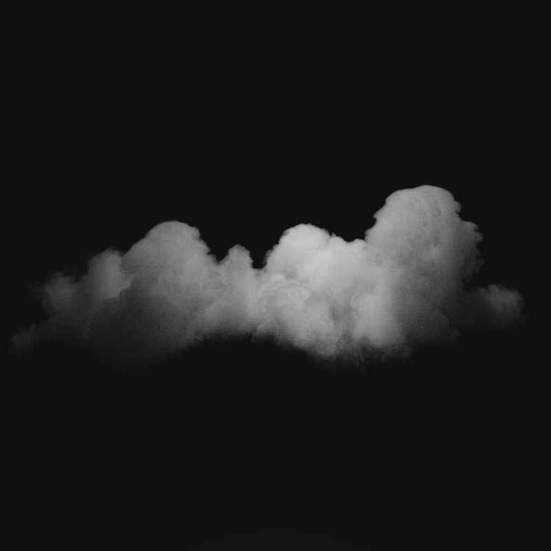

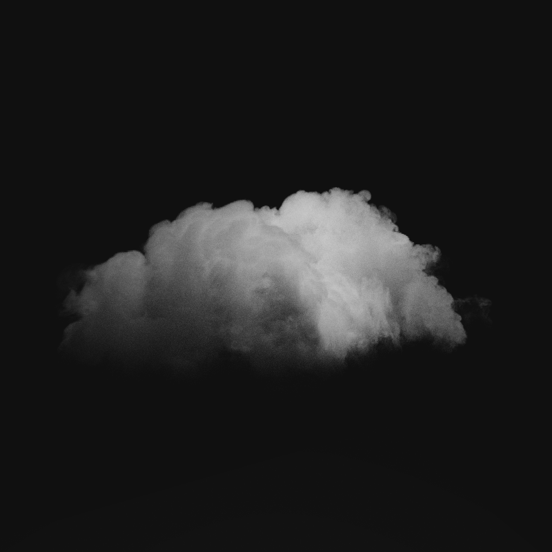

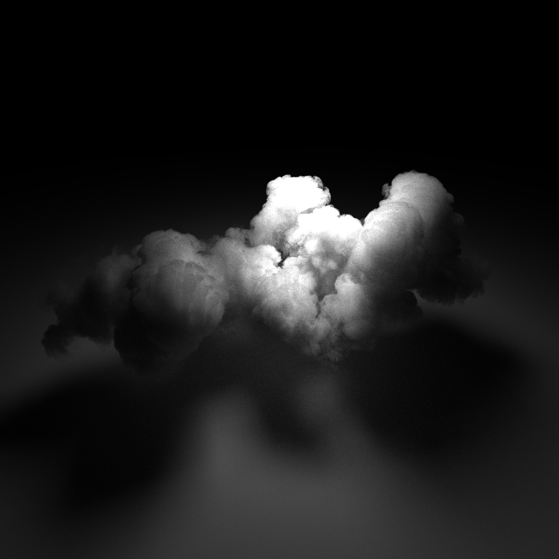

## Features

This is a GPU renderer built in C++ and CUDA.  It uses path-tracing to render scenes and the light that bounces around in them realistically.  It features

- Wavefront Pathtracing used to improve warp coherence
- Multiple Importance Sampling
- Depth of Field
- Volumes using Woodcock Tracking
- VDB Loading and Fast Ray Traversal
- Emissive Volumes that use temperature from VDB

## Overview

### Wavefront Pathtracing

In order to improve warp coherence, we ues wavefront pathtracing.  We split the normal pathtracing operatins (ray-scene intersect, shade, bounce..) into multiple steps.  While adding overhead, it allows us to have optimizations like **removing paths that don't contribute light early** and **sorting intersections by material so warps are doing similar instructions**.

### Diffuse Surfaces

To simulate diffuse surfaces, when the ray bounces, we can sample a random direction in the hemisphere aligned with the normal.  We assume diffuse surfaces are completely rough; **every photon that bounces on it goes in a random direction with equal probability**.

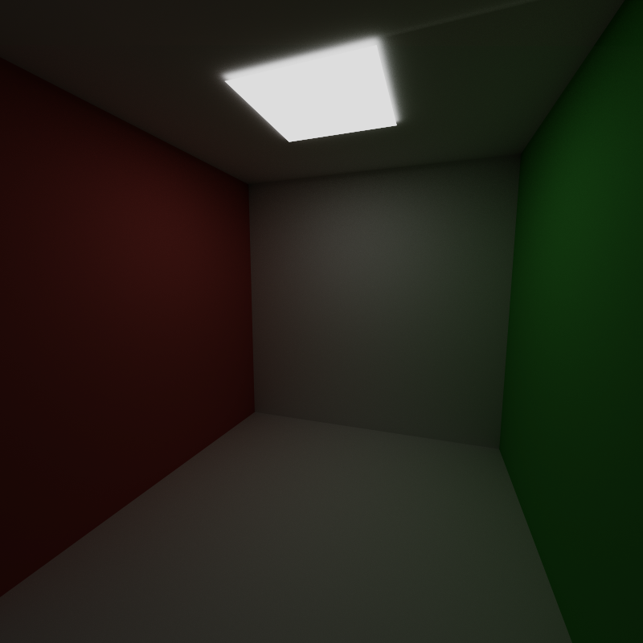

This gives the appearance of concrete.

### Multiple Importance Sampling

#### Importance Sampling

This project features Multiple Importance Sampling (MIS).  MIS is an addition to importance sampling, the idea of sampling certain directions on ray bounce more often.  For example, if you know one direction will be particularly bright, you can sample that direction more (and then divide by the probability of doing so to normalize).  It's most important to sample directions with lots of light often since they contribute the most, we want them to be the most accurate.

#### Adding Multiple Importance Sampling

MIS builds upon this idea.  We don't always know what direction will give us the most light, but we can approximate it based on different models.  We can approximate it based on the **material** of the object and the **lights** in the scene.  So we have two sampling methods, material (or BSDF sampling) and direct light sampling.  MIS is how we combine these two methods.  We basically take a BSDF sample and a direct light sample and add them and divide each one by the total probability that that direction was sampled overall (to normalize).  (Though sometimes we add a power to it).

Running MIS on every bounce allows us to accumulate light per bounce, which means we can converge much faster.  Here's a comparison with and without MIS.

| MIS after 500 Samples | No MIS after 500 Samples |
| ---- | ---- |
| 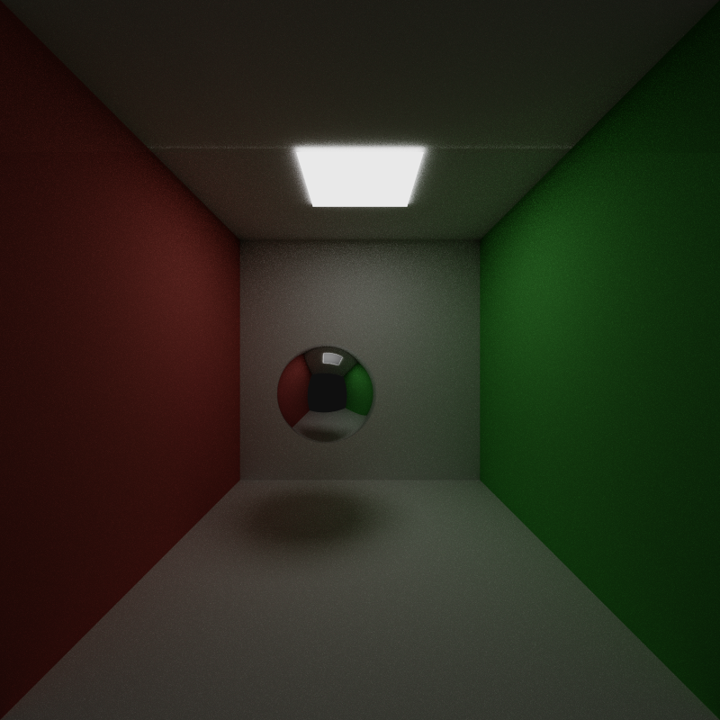 | 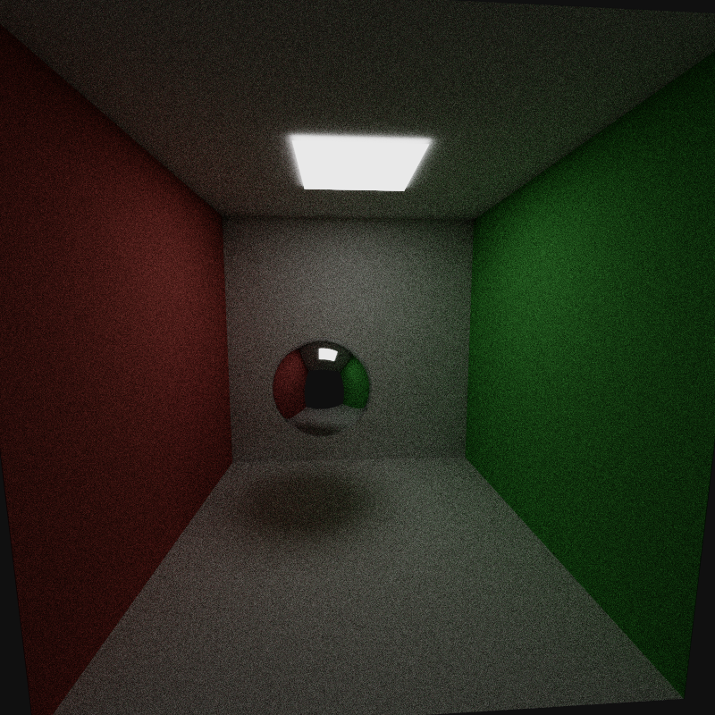 |

### Depth of Field

To simulate depth of field, we can offset the starting positions of rays randomly a bit (cylindrically) to simulate the fact that camera lenses aren't infinitely small.  We then have the rays go directly to a focal plane.  It makes everything at a certain specified distance from the camera look crisp (in focus), while everything else looks blurry (out of focus).

| Depth of Field Off | Depth of Field On Focus Sphere |
| ---- | ---- |
| 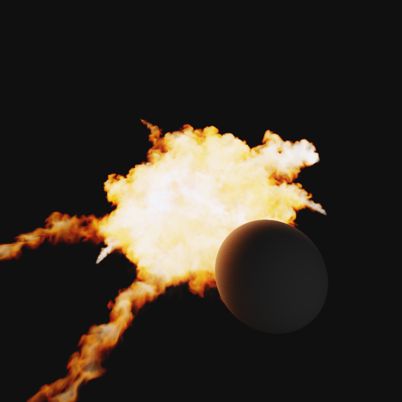 | 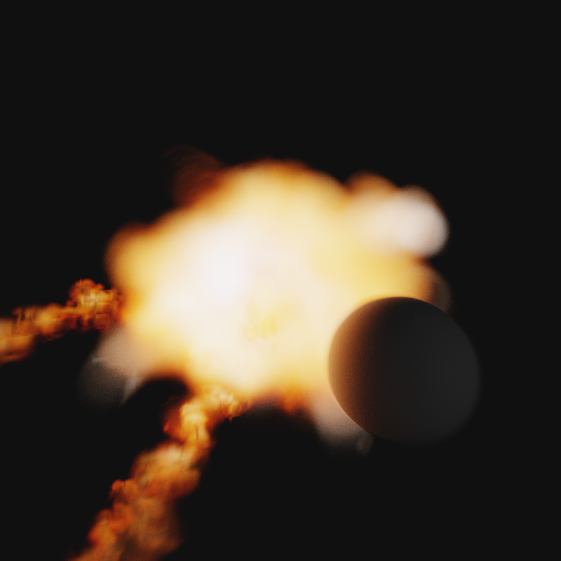 |

### Volumes

To render volumes, I used Woodcock/Deltatracking pathtracing, which basically models the probability of photons colliding with clouds.  We do a probability roll to see how long a ray will take to collide within a cloud, bounce it (or absorb it), then collide the ray with the cloud again.  The ray will keep bouncing within the cloud until it escapes or gets absorbed.  A dense cloud will have the ray bounce short distances since it collides within short distances while a low-density cloud will allow the ray to escape much faster through high distance bounces.

Delta tracking works perfectly with homogeneous volumes, but we want our density to vary, so we need an additional probability roll after our ray steps to see if we actually hit the volume.  The most important part of this is the fact that we need an **upper bound of the max density of the volume** for the part we traversed.

We also do a direct light sample at each bounce in the cloud to converge faster.

For the volume phase function, I used the Henyey greenstein function which scatters light anisotropically.  I blended an intensely forward scattering lobe with a slight backward scattering lobe to get the appearance of fluffy clouds.

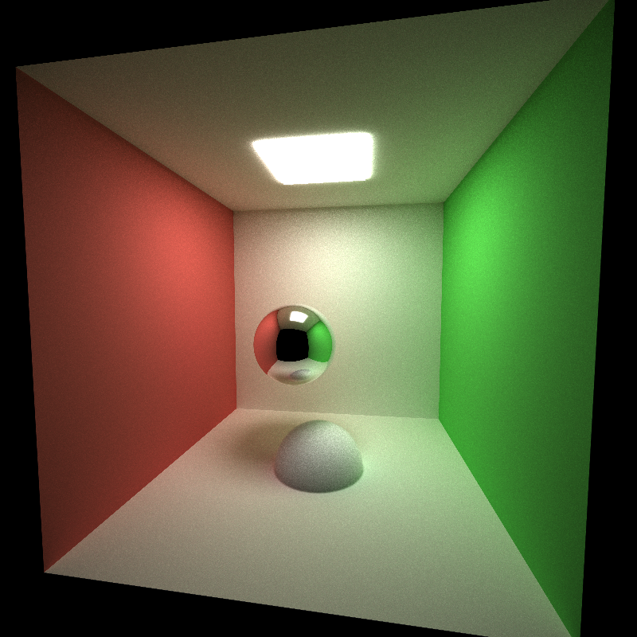

### VDB Loading & Traversal

#### What's a VDB

To render interesting cloud volumes, I wanted to load in VDB files.  VDB files store volumes and there are plenty of cloud VDBs available online.  To load and use them I used the NanoVDB library.

To do Delta tracking on a VDB, you need to do a sort of tree marching.  VDBs are organized in a hierarchical manner, where you have a Upper grid, where each cell may contain a Lower grid, and each cell of the lower grid may contain a Leaf grid, and each cell of the leaf grid contains your actual voxel.  So there are a lot of layers of redirection.  The reason for this is to save storage in sparse VDBs.  If there's a huge chunk of air, the VDB won't store it.  If it had to, VDBs would be wayy too massive.

| 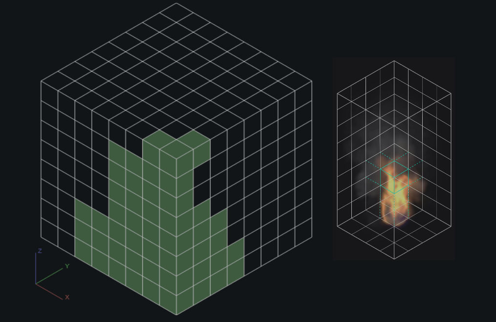 |
| --- |
| From [JangaFX](https://jangafx.com/insights/vdb-a-deep-dive) |

As you can see in the demo above, we only need to store the bricks in green since everything else is empty.  For higher level of detail, those green bricks will store sub-grids which in turn have sub-grids.

#### Traversal

We could naively traverse the VDB by treating it like any other field where we can just do SampleDensity(x, y, z), but this isn't taking advantage of the VDB and will lead to vary slow runtimes.

| 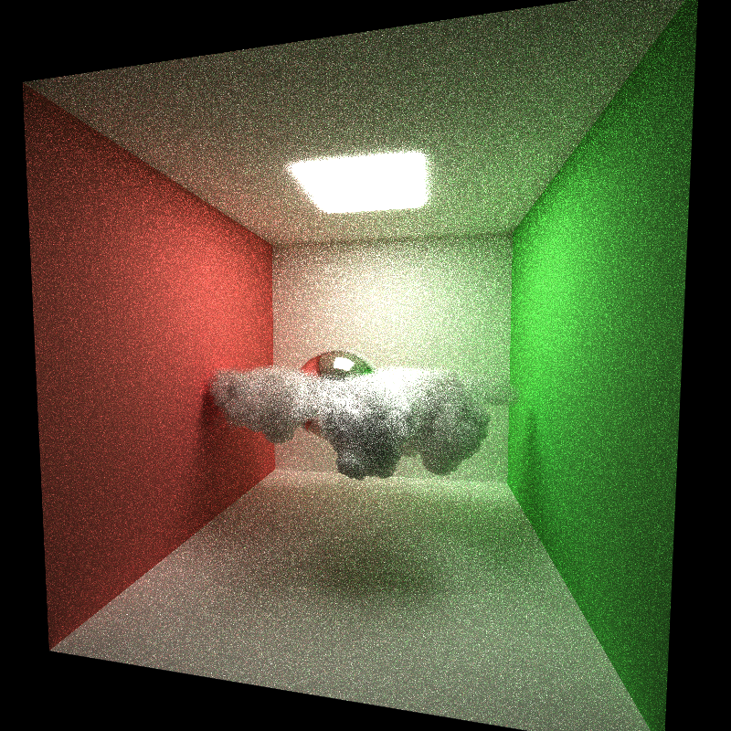 |
| --- |
| The cloud looks right but it takes so long to render.. |

In order to traverse this hierarchical grid quickly, we basically do raymarching on the highest level grid until we find a upper level cell that isn't completely empty (would be a green cell in the above image) at which point we jump down to a lower level tree and repeat until eventually we've jumped down to a leaf grid.  At that point, we do our delta tracking of the volume and use the max density of the leaf we're in to see if we actually hit the volume.  We do delta tracking until we hit an inactive part of the voxel world, at which point we repeat our traversal to get to an active leaf and continue delta tracking until our ray finally collides with the cloud and bounces.

| 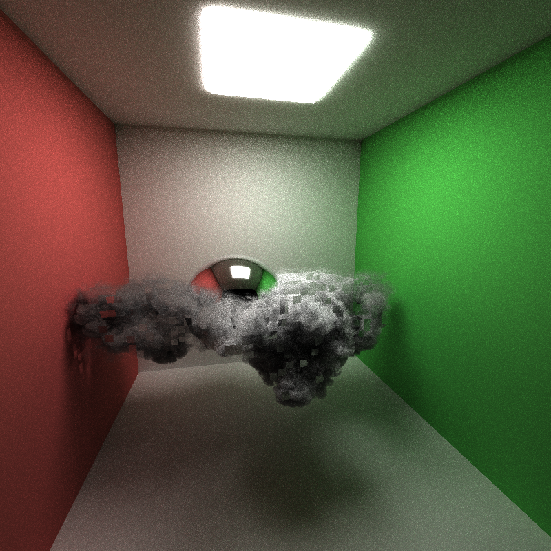 |
| --- |
| My voxel traversal had a bug so it looked really voxelly |

But it runs way faster after fixing.  This allows me to use really high bounce counts which makes clouds look nicer too (we want to give rays enough bounces to escape clouds).  Without high bounce counts, clouds look a little too dark.  The above shows **5000 samples** at **50 ray bounces** where each iteration is about **20-25ms**.

|  | 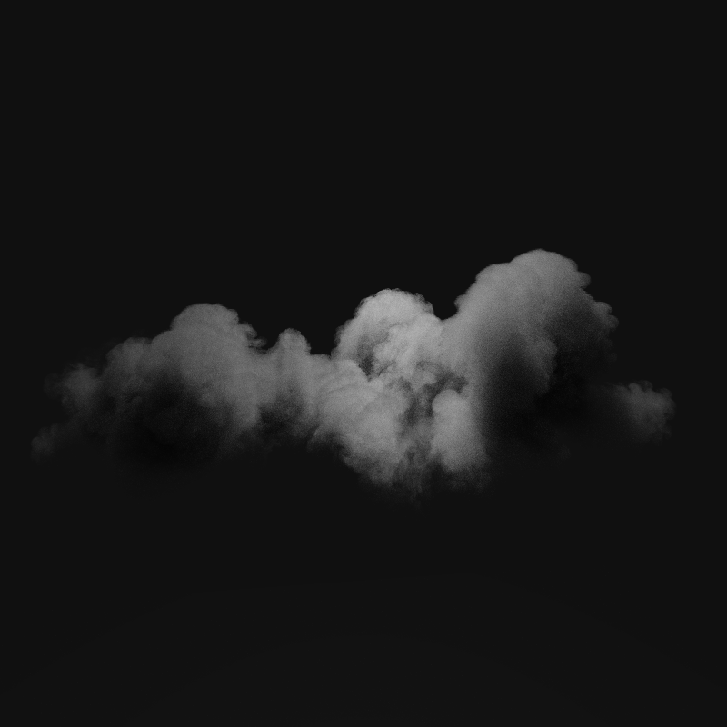 |
| --- | --- |
| 50 Bounces | 5 Bounces |

| 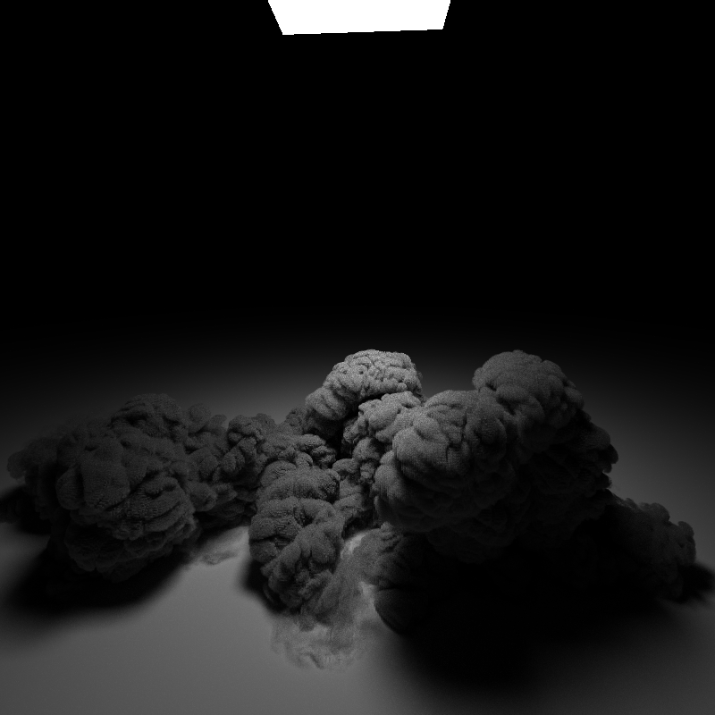 |
| --- |
| If we increase the density multiplier really high, the clouds look like cotton |

### Emissive Volumes

I wanted to make explosions, which necessitates the addition of the temperature grid.  An explosion VDB will generally have a temperature and density grid.  

When a ray bounces through the volume, we now evaluate the temperature to get the emitted light, and accumulate it.  In order to convert the temperature to RGB light, I used the formula from [Tanner Helland's blog](https://tannerhelland.com/2012/09/18/convert-temperature-rgb-algorithm-code.html).

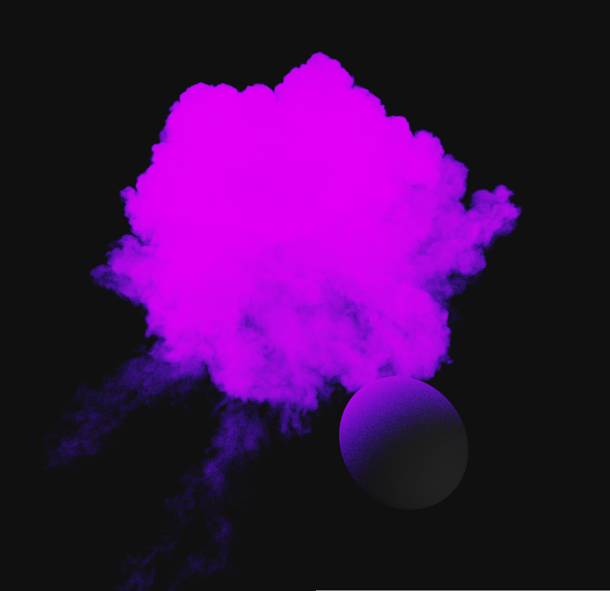

Remapped temperature incorrectly

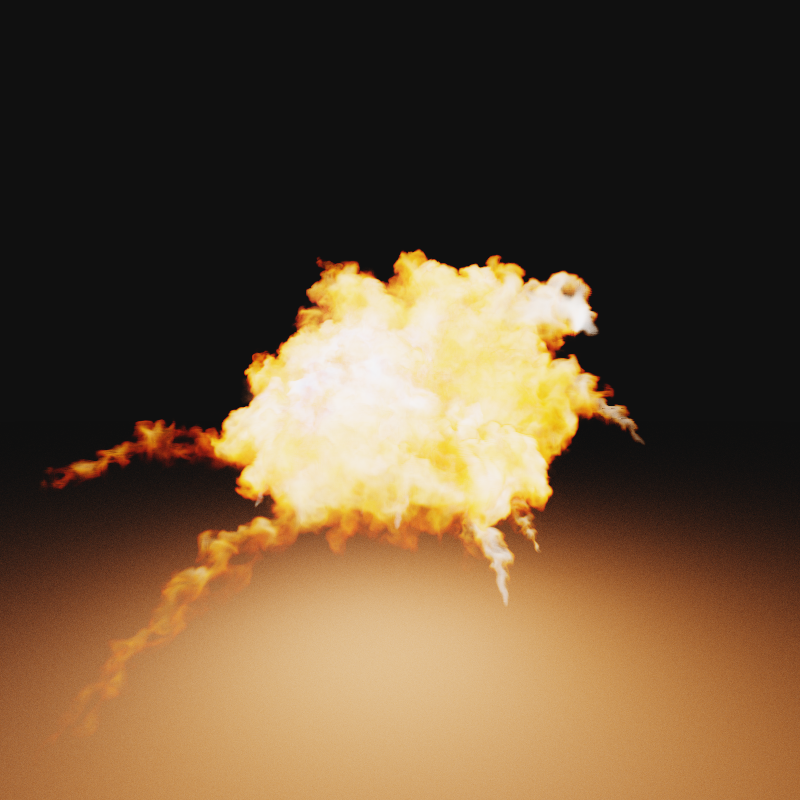

But looks like an explosion when fixed.  Also converges very fast since there's so much emission everywhere, allowing me to create animations pretty fast.  The framerate is around **45FPS** on my laptop for this explosion.

### Performance Analysis

Stream compaction will remove rays that stop contributing (ie. fall into void).  In an open scene, we get to remove tons of rays that stop contributing instead of continuing to spend GPU resources on them, improving the FPS.  However, in a closed scene, rays won't fall into the void so we don't end up removing them, even with stream compaction, so the FPS stays the same.

### Future Plans

- Spectral Rendering so explosions look more accurate.  I'll also try adding animating fire.
- Direct Light Sampling of Emissive VDBs

### VDB Sources

All VDBs taken from [JangaFX](https://jangafx.com/software/embergen/download/free-vdb-animations)
